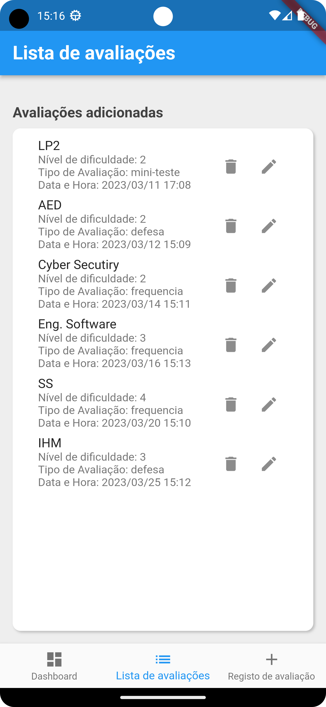
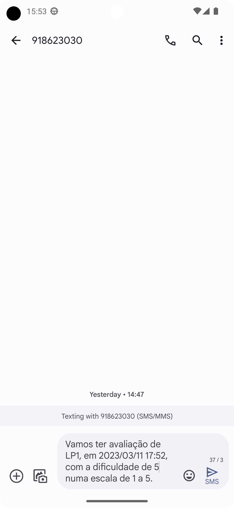

# iquechumbei_app
1. Aplicação móvel desenolvida em Flutter para a disciplina de Computação móvel, 
com o .apk testado no Pixel 6 Pro com android 13.0.
2. Construi esta aplicação usando o shared_preferences para guardar os dados do utilizador, 
mesmo que a mesma seja fechada, os dados do utilizador são guardados e quando volta a abrir a 
aplicação, os dados passados são carregados/loaded, 
tornado assim esta aplicação útil e podendo ser utilizada.

## Dados de aluno

Nome: João Pedro Matos  
Número: a22202497

## Screenshots dos ecrãs
# Dashboard (1): \n
# Dashboard (2): \n
# Dashboard (3): \n
# Lista de Avaliações: \n
# Lista de Detalhe: \n
# Lista de Detalhe (Share/Dealer): \n
# Lista de Avaliações (Eliminar): \n
# Lista de Avaliações (Eliminado): \n
# Lista de Avaliações (Editar): \n
# Lista de Avaliações (Editar): \n
# Lista de Avaliações (Editado): \n
# Registo de Avaliação:  \n
# Registo de Avaliação:  \n

## Funcionalidades

\n

Segundo este quadro facultado pelo professor, a aplicação tem as seguintes funcionalidades:

1. Criação de uma lista de avaliações, com as seguintes características através de um formulário no 
ecrã de registo em que é pedido ao utilizador:
    1. Nome da disciplina
    2. Tipo de avaliação
    3. Data e hora da avaliação
    4. Nível de dificuldade esperado para essa avaliação
    5. Observações como campo opcional
2. Edição de uma avaliação com verficação de confirmação por parte do utilizador.
3. Eliminação de uma avaliação com verficação de confirmação por parte do utilizador.
4. Consulta do detalhe de uma avaliação em que temos a informação da avaliação, bem como a 
possibiliade de partilhar a mesma através da funcionalidade implementada Dealer.
5. Fiz um dashboard em que aparece o cálculo da média da dificuldade das avaliações para os próximos
7 dias, bem como entre os 7 e os 14 dias, assim como a lista das próximas avaliações num
período de 7 dias, identifcando o próprio dia/ dia seguinte a vermelho, e os restantes dias a 
laranja, ambos com a data e a hora da avaliação (achei pretinente na ótica do User Experience).
6. Por fim, foram feitos algum testes unitários que achei pretinentes.

## Dealer

 \n
 \n
 \n
 \n
(Neste print é mostrado o texto num mensagem de texto pronta a enviar)

A função dealer foi implementada com a função Share.share() mostrada em cima. 
Usei a biblioteca 'share' do flutter que permite partilhar o texto, passando-lhe a 
variável textToShare. Nota que foi necessário adicionar a dependencia no pubspec.yaml: share: ^2.0.4.
Também foi necessário fazer este import 'package:share/share.dart';
Assim, esta funcionalidade foi implementada no ecrã de detalhe com recurso ao botão Partilhar 
avaliação.

## autoavaliação
Nota: 15 valores